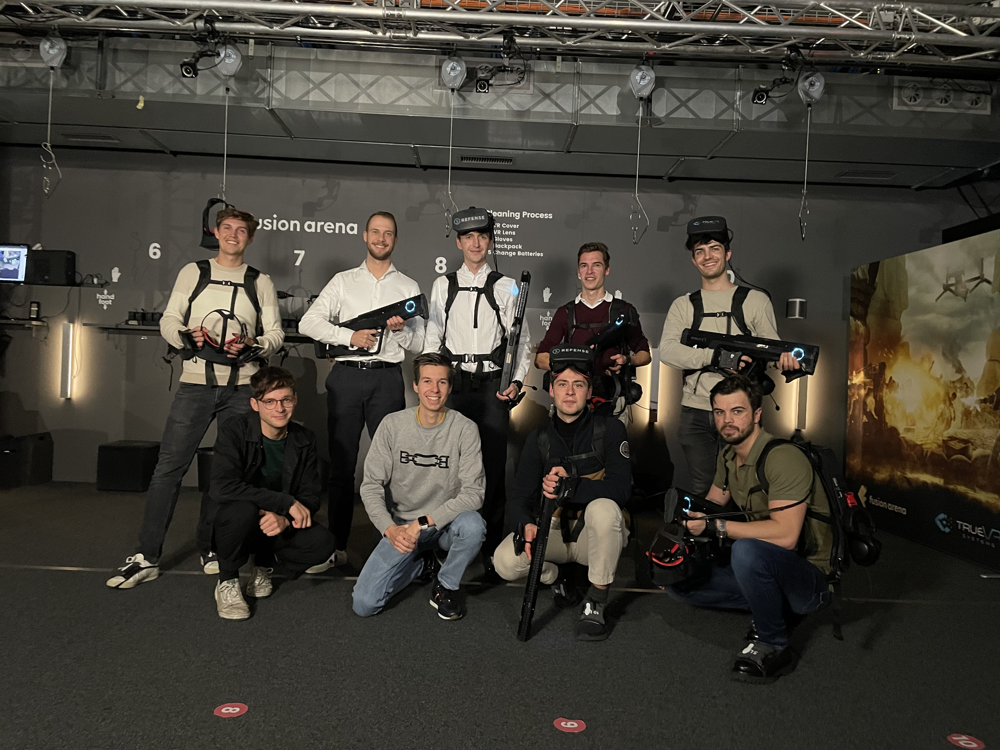
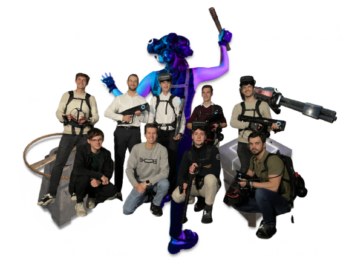

# fa-player-photos
Detection of player and team photos on the playing court and classification to checkin data

## Introduction
...will be used in the Fusion Arena to match captured photos (and maybe videos) with the respective player group.

## Process

1. FA Operator takes a photo of a group of players in front of the VR suit up stations
2. The photos will eventually be uploaded to the cloud (currently Google Photos)
3. This programm will fetch new photos from the publicly shared album
4. This programm try to detect aruco markes on the photo
   - When identified, this programm will match the photo either court "left" or "right"
5. This programm will try to match a group of customers to the photo depending on the court and timestamps of both the photo and the checkin data
6. This programm will remove the background and replace it with placeholder depending on the played game
7. This programm will save the edited images in the cloud
8. This programm sends the URL to the respective group of players
9. The customers share the image in their stories. GREAT SUCCESS!

## Examples

### Detection of ArUco markers
- Scene A

- Scene B

### Background removal
- Original image

- images replace by dummy background

See [demo.py](demo_prototype/demo.py) for more

